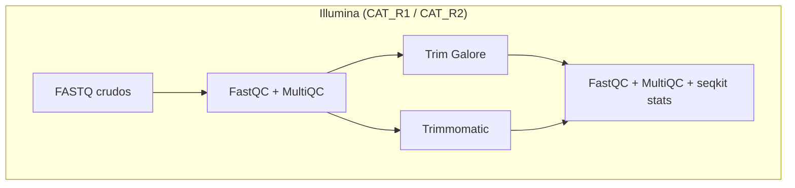
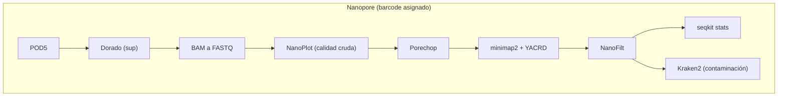

# Semana 04: Basecalling de los datos de secuenciación - Visualización de la calidad y limpieza de los archivos FASTQ

## Logro de la sesión:

Al finalizar la sesión, el estudiante realiza el basecalling de los archivos POD5 y la limpieza de los archivos FASTQ con diferentes herramientas bioinformáticas, interpreta las métricas de calidad de los datos Illumina y Nanopore, cuantifica el efecto de cada paso de limpieza sobre el número de lecturas y de bases, y evalúa la presencia de contaminación en los datos de Nanopore con Kraken2.

## Estructura de la práctica:

1. Acceso al servidor de cómputo
2. Análisis de calidad de archivos FASTQ de Illumina
3. Limpieza de los archivos FASTQ de Illumina
4. Basecalling de los archivos POD5 de Nanopore
5. Análisis de calidad de archivos FASTQ de Nanopore
6. Limpieza de los archivos FASTQ de Nanopore
7. Análisis de contaminación con Kraken2
8. Análisis de calidad, limpieza y contaminación de los datos de secuenciación Nanopore generados en el curso

## Flujo de trabajo:

### Illumina:


### Nanopore:



## Programas requeridos:

### Programas de acceso al servidor:

PuTTY v0.79 https://www.chiark.greenend.org.uk/~sgtatham/putty/latest.html
   - **Descripción:** PuTTY es un cliente SSH, Telnet y Rlogin gratuito y de código abierto para Windows y sistemas Unix. Se utiliza principalmente para establecer conexiones seguras de línea de comandos a servidores remotos.

WinSCP v6.1 https://winscp.net/eng/download.php
   - **Descripción:** WinSCP es un cliente SFTP, FTP, WebDAV, Amazon S3 y SCP gratuito y de código abierto para Windows. Permite la transferencia segura de archivos entre un ordenador local y servidores remotos mediante una interfaz gráfica de usuario. En esta práctica se usará para descargar los reportes HTML (FastQC, MultiQC, NanoPlot) y visualizarlos en su computadora.

### Programas bioinformáticos:

Dorado v0.9.1 https://github.com/nanoporetech/dorado
   - **Descripción:** Dorado es una herramienta de Oxford Nanopore Technologies, sucesora de Guppy, para la llamada de bases (basecalling) de las señales eléctricas generadas por sus secuenciadores de ADN. Al igual que Guppy, también incluye funcionalidades para la clasificación de barcodes (multiplexado), el recorte de adaptadores y el filtrado de reads por calidad, pero con mejoras en rendimiento y precisión.

FastQC v0.12.1 http://www.bioinformatics.babraham.ac.uk/projects/fastqc/
   - **Descripción:** FastQC es una herramienta de control de calidad para datos de secuenciación de alto rendimiento. Proporciona un informe detallado que ayuda a identificar posibles problemas en los datos brutos antes del análisis posterior.

Kraken2 v2.1.3 https://github.com/DerrickWood/kraken2
   - **Descripción:** Kraken2 es un clasificador taxonómico de secuencias basado en k-mers: compara cada lectura con una base de datos de genomas de referencia y le asigna un taxón. Aquí se usa para detectar contaminación en los FASTQ de Nanopore, con la base de datos PlusPF (arqueas, bacterias, virus, plásmidos, humano, protozoos y hongos).

Minimap2 v2.28 https://github.com/lh3/minimap2
   - **Descripción:** Minimap2 es un alineador de secuencias versátil y de alta velocidad diseñado para lecturas largas (Nanopore y PacBio). En esta práctica se usa para calcular los solapamientos entre lecturas (all-vs-all) que necesita YACRD.

MultiQC v1.28.0 https://multiqc.info
   - **Descripción:** MultiQC es una herramienta que agrega informes de control de calidad de múltiples herramientas de análisis bioinformático en un único informe HTML interactivo. Es compatible con una amplia gama de herramientas, incluyendo FastQC, Cutadapt/Trim Galore! y Trimmomatic, facilitando la revisión y comparación de los resultados de control de calidad de múltiples muestras.

NanoFilt v2.8.0 https://github.com/wdecoster/nanofilt
   - **Descripción:** NanoFilt es una herramienta para filtrar datos de secuenciación de Nanopore basándose en la calidad y la longitud de los reads. Permite seleccionar reads de alta calidad para análisis posteriores.

NanoPlot v1.41.6 https://github.com/wdecoster/NanoPlot
   - **Descripción:** NanoPlot es una herramienta para la visualización de datos de secuenciación de Nanopore. Genera varios tipos de gráficos para evaluar la calidad y las características de los reads, como la distribución de longitudes y la calidad a lo largo de los reads.

PycoQC v2.5.2 https://github.com/a-slide/pycoQC *(opcional: no se utiliza en esta práctica)*
   - **Descripción:** PycoQC es una herramienta para el control de calidad de datos de secuenciación de Oxford Nanopore, similar a FastQC pero diseñada específicamente para este tipo de datos. Genera informes interactivos en HTML con diversas métricas de calidad.

Porechop v0.2.4 https://github.com/rrwick/Porechop
   - **Descripción:** Porechop es una herramienta para identificar y recortar adaptadores en los extremos de los reads de Oxford Nanopore. Cuando detecta un adaptador en el interior de un read, lo considera quimérico y lo divide en reads separados. *Nota: su autor lo declaró oficialmente sin mantenimiento en 2018; se usa aquí con fines didácticos para comparar con el recorte que ya realiza Dorado.*

TrimGalore v0.6.10 https://github.com/FelixKrueger/TrimGalore
   - **Descripción:** Trim Galore! es un wrapper alrededor de Cutadapt y FastQC para realizar el recorte de adaptadores y el control de calidad en datos de secuenciación de alto rendimiento. Automatiza el proceso de recorte y genera informes de calidad.

Trimmomatic v0.39 http://www.usadellab.org/cms/?page=trimmomatic
   - **Descripción:** Trimmomatic es una herramienta flexible y rápida para realizar el recorte de adaptadores y el filtrado de calidad en datos de secuenciación de Illumina. Permite eliminar secuencias de adaptadores, bases de baja calidad y reads demasiado cortos.

YACRD v0.6.2 https://github.com/natir/yacrd
   - **Descripción:** YACRD (Yet Another Chimeric Read Detector) es una herramienta especializada en la detección de lecturas quiméricas y regiones sin cobertura en datos de secuenciación de lecturas largas. Permite "limpiar" (scrubb) o dividir las lecturas donde se detectan uniones accidentales, mejorando significativamente la contigüidad y precisión de los ensamblajes genómicos posteriores.

### Herramientas auxiliares (ya instaladas en el servidor):

SAMtools https://www.htslib.org
   - **Descripción:** Conjunto de utilidades para manipular archivos SAM/BAM. Aquí se usa para ordenar los BAM generados por Dorado.

BEDTools https://bedtools.readthedocs.io
   - **Descripción:** Conjunto de utilidades para manipular archivos genómicos. Aquí se usa `bamtofastq` para convertir BAM a FASTQ.

SeqKit https://bioinf.shenwei.me/seqkit/
   - **Descripción:** Kit de herramientas para manipular y resumir archivos FASTA/FASTQ. Aquí se usa para calcular estadísticas de los FASTQ (`stats`) y, antes de Kraken2, para renombrar las lecturas (`rename`).

## Metodología:

## 1. Acceso al servidor de cómputo:

### Abrir el programa PuTTY, colocar el hostname ( 10.142.250.66 ) y port ( 22 ), y dar clic en Open:


### En la terminal abierta, escribir su usuario y contraseña correspondiente para tener acceso al servidor de cómputo Tensor:
 


### Abrir el programa WinSCP, colocar el hostname ( 10.142.250.66 ) y port ( 22 ), escribir su usuario y contraseña correspondiente para tener acceso al servidor de cómputo Tensor, y hacer clic en Login:


### Crear la estructura de carpetas de trabajo

Una vez dentro del servidor, crear **de una sola vez** todas las carpetas que se usarán durante la práctica:

```bash
cd

mkdir -p ~/genomics/{basecalling/pod5_db_sup,quality/{illumina,nanopore},trimming/{illumina/{trim_galore,trimmomatic},nanopore},contamination}

tree ~/genomics
```

> **Comentario:**
> - `mkdir -p`: crea las carpetas indicadas y también las carpetas intermedias que falten; si ya existen, no da error.
> - `{a,b}`: es una expansión de llaves de Bash; `quality/{illumina,nanopore}` equivale a escribir `quality/illumina quality/nanopore`.
> - `tree ~/genomics`: muestra el árbol de carpetas para verificar que quedó como en la sección 7.

> **Importante:** Las rutas de los comandos siguientes asumen esta estructura. Si cierra y vuelve a abrir PuTTY, siempre debe volver a activar el entorno conda que corresponda (`conda activate ...`).

## 2. Análisis de calidad de archivos FASTQ de Illumina

```bash
cd ~/genomics/quality/illumina

conda activate quality

fastqc -t 10 /data/2025_1/database/illumina/CAT_R1.fastq.gz /data/2025_1/database/illumina/CAT_R2.fastq.gz -o .
```

> **Comentario:** 
> - `-t 10`: Esta opción especifica el número de hilos (threads) que FastQC debe utilizar. FastQC procesa un archivo por hilo, por lo que con 10 hilos analiza R1 y R2 al mismo tiempo.
> - `/data/2025_1/database/illumina/CAT_R1.fastq.gz` y `.../CAT_R2.fastq.gz`: Rutas de los archivos que FastQC debe analizar (lecturas R1 y R2 del par).
> - `-o .`: Esta opción define el directorio de salida. El punto "." representa el directorio actual. Esto significa que los informes HTML generados por FastQC se guardarán en el mismo directorio donde se ejecuta el comando.

```bash
multiqc -o raw_illumina .
```
> **Comentario:**
> - `-o raw_illumina`: Esta opción especifica el directorio de salida donde se guardará el informe HTML generado por MultiQC.
> - `.`: Representa el directorio actual. Esto le dice a MultiQC que busque archivos de resultados (los que ha generado FastQC por ejemplo) dentro del directorio en el que estás ejecutando el comando. MultiQC buscará automáticamente archivos de salida de las herramientas de control de calidad compatibles que se encuentren en el directorio actual y sus subdirectorios.

> **Punto de control:** Descargue `raw_illumina/multiqc_report.html` con WinSCP y revise, para R1 y R2: *Per base sequence quality*, *Adapter content*, *Per base N content* y *Sequence duplication levels*. ¿Baja la calidad hacia el extremo 3' de las lecturas? ¿Hay adaptadores presentes?

## 3. Limpieza de los archivos FASTQ de Illumina

### Limpieza con trim galore

```bash
cd ~/genomics/trimming/illumina/trim_galore

trim_galore --quality 30 --length 50 --phred33 --cores 2 --fastqc --paired --output_dir . /data/2025_1/database/illumina/CAT_R1.fastq.gz /data/2025_1/database/illumina/CAT_R2.fastq.gz 2> trim_galore_CAT.log
```

> **Comentario:**
> - `--quality 30`: Esta opción especifica el umbral de calidad para el recorte de bases. Las bases con una calidad inferior a 30 (en escala Phred33) serán recortadas del extremo 3' de las lecturas. Es un umbral estricto (el valor por defecto de Trim Galore! es 20).
> - `--length 50`: Esta opción establece la longitud mínima de las lecturas después del recorte. Las lecturas que sean más cortas que 50 bases serán descartadas.
> - `--phred33`: Esta opción indica que los datos de calidad de las bases están en la escala Phred33, que es la escala más común utilizada en la secuenciación Illumina.
> - `--cores 2`: Esta opción especifica el número de núcleos de procesamiento que Trim Galore! debe utilizar. En este caso, se están utilizando 2 núcleos para acelerar el procesamiento.
> - `--fastqc`: Esta opción le indica a Trim Galore! que ejecute FastQC automáticamente después del recorte para generar informes de control de calidad de los datos recortados.
> - `--paired`: Esta opción indica que los datos son pareados (paired-end), lo que significa que las lecturas vienen en pares (R1 y R2). Si una lectura se descarta, su pareja también se descarta para mantener el emparejamiento.
> - `--output_dir .`: Guarda los resultados en el directorio actual (por defecto ya se guardan ahí; se indica explícitamente para evitar confusiones).
> - `/data/2025_1/database/illumina/CAT_R1.fastq.gz`: Esta es la ruta del archivo FASTQ comprimido que contiene las lecturas R1 (la primera lectura del par).
> - `/data/2025_1/database/illumina/CAT_R2.fastq.gz`: Esta es la ruta del archivo FASTQ comprimido que contiene las lecturas R2 (la segunda lectura del par).
>
> Trim Galore! detecta automáticamente el tipo de adaptador (Illumina, Nextera o small RNA). Los archivos resultantes se llaman `CAT_R1_val_1.fq.gz` y `CAT_R2_val_2.fq.gz`, y los reportes de recorte terminan en `_trimming_report.txt`.

```bash
multiqc -o trimming_trim_galore .
```

### Limpieza con trimmomatic

```bash
cd ~/genomics/trimming/illumina/trimmomatic
```

> **Comentario:** Crear el archivo de adaptadores NexteraPE.fa. Trimmomatic incluye este mismo archivo (`NexteraPE-PE.fa`) en su carpeta `adapters/`; aquí lo crearemos manualmente para ver cómo es su formato.

```bash
nano NexteraPE.fa

>PrefixNX/1
AGATGTGTATAAGAGACAG
>PrefixNX/2
AGATGTGTATAAGAGACAG
>Trans1
TCGTCGGCAGCGTCAGATGTGTATAAGAGACAG
>Trans1_rc
CTGTCTCTTATACACATCTGACGCTGCCGACGA
>Trans2
GTCTCGTGGGCTCGGAGATGTGTATAAGAGACAG
>Trans2_rc
CTGTCTCTTATACACATCTCCGAGCCCACGAGAC

cat NexteraPE.fa
```

```bash
trimmomatic PE -threads 10 -phred33 /data/2025_1/database/illumina/CAT_R1.fastq.gz /data/2025_1/database/illumina/CAT_R2.fastq.gz CAT_R1.trim.fastq.gz CAT_R1.unpaired.fastq.gz CAT_R2.trim.fastq.gz CAT_R2.unpaired.fastq.gz ILLUMINACLIP:NexteraPE.fa:2:30:10 SLIDINGWINDOW:4:30 MINLEN:50 2> trimmomatic_CAT.log

cat trimmomatic_CAT.log
```

> **Comentario:**
> - `PE`: Indica que los datos son pareados (paired-end).
> - `-threads 10`: Número de hilos. 
> - `-phred33`: Indica la codificación de calidad de las bases.
> - `/data/2025_1/database/illumina/CAT_R1.fastq.gz`: Esta es la ruta del archivo FASTQ comprimido que contiene las lecturas R1 (la primera lectura del par).
> - `/data/2025_1/database/illumina/CAT_R2.fastq.gz`: Esta es la ruta del archivo FASTQ comprimido que contiene las lecturas R2 (la segunda lectura del par).
> - `CAT_R1.trim.fastq.gz`: Archivo de salida para las lecturas R1 recortadas y emparejadas.
> - `CAT_R1.unpaired.fastq.gz`: Archivo de salida para las lecturas R1 que quedaron sin par después del recorte.
> - `CAT_R2.trim.fastq.gz`: Archivo de salida para las lecturas R2 recortadas y emparejadas.
> - `CAT_R2.unpaired.fastq.gz`: Archivo de salida para las lecturas R2 que quedaron sin par después del recorte.
> - `ILLUMINACLIP:NexteraPE.fa:2:30:10`: Son los parámetros para el recorte de adaptadores (seed mismatches:umbral de coincidencia palindrómica:umbral de coincidencia simple).
> - `SLIDINGWINDOW:4:30`: Se analiza la lectura con una ventana deslizante de 4 bases; cuando la calidad promedio dentro de la ventana cae por debajo de 30, se recorta la lectura desde ese punto hasta el extremo 3'.
> - `MINLEN:50`: Esta opción establece la longitud mínima de las lecturas después del recorte. Las lecturas que sean más cortas que 50 bases serán descartadas.
> - `2> trimmomatic_CAT.log`: Trimmomatic imprime su resumen (pares de entrada, pares que sobreviven, etc.) por la salida de error; se guarda en un archivo para poder usarlo en la bitácora y para que MultiQC lo lea.

```bash
fastqc -t 10 *.trim.fastq.gz -o .

multiqc -o trimming_trimmomatic .
```

### Comparación entre los datos crudos y las dos limpiezas

```bash
cd ~/genomics/trimming/illumina

seqkit stats -a -j 10 /data/2025_1/database/illumina/CAT_R1.fastq.gz /data/2025_1/database/illumina/CAT_R2.fastq.gz trim_galore/CAT_R1_val_1.fq.gz trim_galore/CAT_R2_val_2.fq.gz trimmomatic/CAT_R1.trim.fastq.gz trimmomatic/CAT_R2.trim.fastq.gz > stats_illumina.txt

cat stats_illumina.txt
```

> **Punto de control:** Compare `num_seqs`, `sum_len`, `avg_len` y `Q30(%)` entre los datos crudos, Trim Galore! y Trimmomatic. ¿Qué herramienta conservó más lecturas? ¿Cuál mejoró más la calidad? ¿Por qué los resultados no son idénticos si se usaron los mismos umbrales de calidad y longitud?

## 4. Basecalling de los archivos POD5 de Nanopore

#### Verificación previa

```bash
dorado --version

nvidia-smi

ls /data/software/dorado-0.9.1-linux-x64/models
```

> **Comentario:**
> - `dorado --version`: confirma la versión de Dorado que se usará (anótela en su bitácora).
> - `nvidia-smi`: muestra las GPU del servidor y la memoria en uso. Verifique que la GPU esté disponible antes de lanzar el basecalling, porque el servidor es compartido.
> - `ls .../models`: lista los modelos de basecalling ya descargados en el servidor.

#### Basecalling

```bash
cd ~/genomics/basecalling/pod5_db_sup

dorado basecaller sup --kit-name SQK-NBD114-24 --min-qscore 10 --device "cuda:0" --barcode-both-ends --models-directory /data/software/dorado-0.9.1-linux-x64/models /data/2025_1/database/nanopore/pod5/ > wasp_calls.bam
```

> **Comentario:** 
> Al iniciar, Dorado imprime el nombre del modelo que está usando (por ejemplo, `dna_r10.4.1_e8.2_400bps_sup@v5.0.0`). **Anótelo**: debe reportarse en la metodología de la bitácora.
>
> - `sup`: Esta opción indica que se debe utilizar el modelo de basecalling de "super precisión" (super accuracy). Estos modelos están entrenados para ofrecer una mayor exactitud en la llamada de bases, a costa de un mayor tiempo de cómputo. Dorado elige automáticamente el modelo `sup` que corresponde a los datos.
> - `--kit-name SQK-NBD114-24`: Este parámetro especifica el nombre del kit de preparación de librería utilizado (Native Barcoding Kit 24 V14). Activa la **clasificación de barcodes** y le indica a Dorado qué adaptadores y barcodes buscar; por defecto Dorado también recorta los adaptadores, primers y barcodes que detecta (esto se desactiva con `--no-trim`). **No** sirve para elegir el modelo de basecalling.
> - `--min-qscore 10`: Esta opción establece un umbral de calidad mínima **para cada lectura completa**: Dorado descarta las lecturas cuyo Q-score **medio** sea menor que 10. No filtra bases individuales. El Q-score es una medida de la probabilidad de que una base llamada sea incorrecta: un Q-score de 10 significa una probabilidad de error de 1 en 10 (10%); Q20, 1 en 100 (1%); Q30, 1 en 1000 (0,1%).
> - `--device 'cuda:0'`: Esto indica que Dorado debe utilizar la primera GPU habilitada para CUDA (índice 0) disponible en tu sistema para acelerar el proceso de basecalling. El uso de la GPU puede reducir significativamente el tiempo de procesamiento.
> - `--barcode-both-ends`: Esta opción le dice a Dorado que exija códigos de barras (barcodes) en ambos extremos de la lectura. Es útil si tu protocolo de secuenciación incluyó barcodes en ambos extremos, pero es más estricto: una lectura con barcode en un solo extremo no se clasifica.
> - `--models-directory /data/software/dorado-0.9.1-linux-x64/models`: Este parámetro especifica el directorio donde Dorado busca modelos ya descargados (o donde descargaría los que falten). Es importante que la ruta sea correcta para que Dorado pueda cargar los modelos necesarios.
> - `/data/2025_1/database/nanopore/pod5/barcode15.pod5`: Esta es la ruta al archivo de entrada POD5 que contiene los datos de señal sin procesar para una muestra con el código de barras (barcode) número 15. Dorado realizará el basecalling de los datos contenidos en este archivo.
> - `> b15_calls.bam`: Esto redirige la salida estándar (stdout) del comando Dorado al archivo llamado b15_calls.bam. Como no se indicó un genoma de referencia (`--reference`), Dorado genera un archivo BAM **sin alinear** (uBAM) con las secuencias base-llamadas y sus etiquetas (por ejemplo, la clasificación de barcode).
> - `\` al final de cada línea: permite escribir un comando largo en varias líneas; no debe haber espacios después de la barra.

#### Conversión de bam a fastq

```bash
dorado demux --output-dir demux_fastq --emit-fastq wasp_calls.bam

seqkit stats -a -j 10 demux_fastq/*.fastq > stats_fastq.txt
```

> **Comentario:** 
> - `seqkit stats`: Calcula las estadísticas de archivos FASTQ que han sido previamente ordenados (-a: todas las estadísticas y -j: número de hilos).
>

```bash
cat stats_fastq.txt

file                                                                                format  type  num_seqs    sum_len  min_len  avg_len  max_len     Q1     Q2       Q3  sum_gap    N50  N50_num  Q20(%)  Q30(%)  AvgQual  GC(%)  sum_n
demux_fastq/bcf4b7732185c1a3353d1b4fe80266cd3ac60162_SQK-NBD114-24_barcode13.fastq  FASTQ   DNA          8      3,457      205    432.1      796  242.5    383    602.5        0    523        3   82.38   71.19    17.53  38.62      0
demux_fastq/bcf4b7732185c1a3353d1b4fe80266cd3ac60162_SQK-NBD114-24_barcode14.fastq  FASTQ   DNA      2,789  2,835,518       13  1,016.7   20,783    428    682    1,145        0  1,381      461   89.65   80.68    19.59  45.73      0
demux_fastq/bcf4b7732185c1a3353d1b4fe80266cd3ac60162_SQK-NBD114-24_barcode15.fastq  FASTQ   DNA          3      3,778    1,087  1,259.3    1,356  1,211  1,335  1,345.5        0  1,335        2      95   86.98    24.74  50.95      0
demux_fastq/bcf4b7732185c1a3353d1b4fe80266cd3ac60162_SQK-NBD114-24_barcode17.fastq  FASTQ   DNA          1        417      417      417      417    417    417      417        0    417        1   84.89   77.22    17.72  36.21      0
demux_fastq/bcf4b7732185c1a3353d1b4fe80266cd3ac60162_unclassified.fastq             FASTQ   DNA      1,227  1,526,649       26  1,244.2   26,983  592.5    864    1,394        0  1,581      245   90.52   81.78    20.14  45.71      0```

> **Comentario:** En `seqkit stats`, `Q20(%)` y `Q30(%)` son el **porcentaje de bases** con calidad ≥ Q20 y ≥ Q30, y `AvgQual` es la calidad media por lectura. No confundir con el resumen de NanoPlot (sección 5), donde `>Q20` y `>Q30` son el **número (y %) de lecturas** cuya calidad media supera ese umbral.

```bash
mv demux_fastq/bcf4b7732185c1a3353d1b4fe80266cd3ac60162_SQK-NBD114-24_barcode14.fastq b14.fastq
```

```bash
head b14.fastq

@00394845-e64b-49a7-af5a-af1b5b008917   qs:f:28.6034    st:Z:2024-04-28T00:01:23.062+00:00      RG:Z:bcf4b7732185c1a3353d1b4fe80266cd3ac60162_dna_r10.4.1_e8.2_400bps_sup@v5.0.0
TTCCCGATCGGCGGATGTTCAGGTATGTCATCTCCCGCAGAAATCGTATACGTTGAAACCACGTGGGTTTCTGACGGGCCGTAATGATTATGCAGCTGCATACCGTGTAAACGGAGCGTCTGTCTGAACAAACGTGAGATAGTCAGCTGCTCCCCGGCCGTAATGACATGCTTCACACAGCGGGGAAAAGACTGTGCATAACCTTCTTCATTGAAAAGCATCTTGACAAACGCAGTCGGGAAAAACACCACTTCCGTTTTGTGCTGATCGATAAACGAATACAGCTGAGAAACATCCCGTTTGATAGATTCGGGCACGATACAAAGGGTGCCGCCGCTCGAGAGTACTGAAAATAACTCCTGATAGCAGACGTCAAACGCCAAAGATGCGTACTGCAGCACATTTGTGCAAAAATCAATGTCTGTGTTCGTCAATTGGTCAGAAAGAAGGTTGGCCATATTTTTATGTTCGAGCAGCACGCCCCTTCGGTTTCCCTGTCGTACCGGATGTATAAATCATATAAAGGAGGTCGTCCGCCGTATTAATGGATTGCACG
+
JGDIG5DB@>CEEJHHNKKPIKOJLKKD;==;=;;999::BANJSRSLSSSNSSRSSOIGFGDSQSSMSSSSMOLIMSKJPSNSSOSLNSSKSSSSSMSSSSSSSSOSQSSSMSSSSSSSSRSOSSSSSOSSSQSSSSSSSLILHGEHGHGGGA;9<=>MISSSNSSNSSSSSOSSNSLSSNSSSSSSSSSSSLIPLNSNSSSSSSSSSSSSSSSSSSSSSNSSMSSKSSSNSSSSIJMSSSSSSSJMISSSSQSPSSSSPSSQMJISOGGGHFSSRSSSOSFFHIIJNSSSSQSOSSMKHHKPSSSSSSSSSSSPSSSSSSIDEGGSSKSFIGOHFED,++++4334<=>DFSMSSSNSSOSSOSSMSKHSSLSSSSOSSNSSSSSMSOSPSSSSIIJSSJINFAFGFNSSSSSSSSSLSSSRSRLLSMNNHJJKGIHNHSSSQNSSSSSSQSSSSSSSSSSSSSSJHJIRSSQSSSSRMSA8+J>>HMSSSSSFQSLIGISSQSSSKMJSNSQJKPILHHFEB9IQKSLMSLS==H@?LFEEFGHFGLMNSDA4
@0cb29fbb-1cad-4984-b8dd-04a930a3f387   qs:f:23.3482    st:Z:2024-04-28T00:00:33.395+00:00      RG:Z:bcf4b7732185c1a3353d1b4fe80266cd3ac60162_dna_r10.4.1_e8.2_400bps_sup@v5.0.0
CTTCCAGTCTCGCGAAGGCGGAAATGCTGTCTGCGTGCGTTTCAAATGCCTTCCGGCTGTAAGAGATGATGCTCGATTTCTTTTGAAAATCTGTTACATTCAACGGGCTTGAAAACCGCGCCGTTCCGTTTGTCGGCAAAACGTGATTCGGTCCGGCAAAATAATCGCCGACCGGTTCAGCGCTGTATCGTCCTAAGAAAATCGCTCCCGCGTGTCTGATGCTTCCAAGCAAAGCCTCCGGCGAATGCGTCATAATTTCTAAATGCTCGGGCGCCAGCGCATTCACCGTGTCCACCGCATCTTCCATCGATTCCGTAATATAAATGCGGCCGTGATCCTTGATCGACCCTTCGGCGATTTCTTTACGCGGCAGTGTCTGAAGCTGTTTATTCACCTCATCTGATACGGCTTCGGCAAGCTTCCGTGAGTCGGTGACAAGCACGCTTGAGCTGAGCGTATCGTGTTCGGCCTGTGAAAGCAGG
+
=@GSSGMINSNSSLKKIEFFELNSSIOSSSSSSSNNSSSIGEAABABHSSMJSSSSSSQSPSSSSSSNSSSSSHJHQJJKOJJC9MOSFSCBBBCBABEJHHHHSSSSSSKMLKHGFCCDHJNLJLNMSSHSSLJMSSSSSSKI==<;>>>>?AEEGIILOD?<=<<FFHGGEEJBA>:;;<=HGGHFJFLIKSDFMEQSSSNORQSIKLJKSSSSSSMJPPJHNJ@:;;;HSRISSOGEFGOSSHLSSSNMH+++++?H?@@SSSSHHFDDLOPOJSSSIIIPJKSQSC==9/..**,,+,,,,,3M@@@@@SSSGGGISHKSGA@-,,,,2226CDFG>>?CDGFFKSSHHSQLKPSSSSSSNSOSQSSOMJLOHIFGGSJISSSSOSSJJISSJPLQHFCBCEDDFIFIHGFJMMHLLGCCCCFSSQGKHSNKSMKMFSIGGGNSSNKCBBCAJSSKSSSSSSSSSSSNNCBB@@@<75
@0b941ebe-49bd-45ca-af16-9bbc5491a523   qs:f:29.7949    st:Z:2024-04-27T23:58:53.183+00:00      RG:Z:bcf4b7732185c1a3353d1b4fe80266cd3ac60162_dna_r10.4.1_e8.2_400bps_sup@v5.0.0
CTAGTGATAGATACACCGTTTCTTGGTTCGTAGTAGCGGGCCATGAGATAGTACAGGCCGGTTTCTTCGTCGTATTGGTAGCCTGCGTAGCGGTAGCGGTTGTCTTTTACTTCGTCGCTTGCTTCGGTTTTTGTCGGATTTCCCCATGCATCGTACTGATATTTGGCAACGGTTTTTCCGGTGCTGTCTGAGATGGCGATGACGTCGCCGTGTGCGTTGTAGTGATAGAAATATTTCTTGCCGTTCTCTGTATAGGATAACAGCTGGCCGCTGTCACCGTACGTGTATGATTTTGTGACGTTGTTGTCGGCGTCTGTTTCATACAGGACGTTCAGGCTGTCTCCGTCGTAGAAGTAGTTCGTAACTTTTCCGTTGACGGTTTTTTGGATTCTGTTTCCTTTTTCATCGTATTTGTATGTTGCGAACGGCTTGTCTTCGCCTTTTTTCGTGACGGCGGTCAGGTTGTCTTCCGCGTCCCACGTATATGTGTATTTGCCGTCCGATGTGCGGTTGCCGTTTTTATCATAGGACAGGTCTTCGTCATTCACCTTCGTCAGCTGGTTCATGATGTTGAAGGATGCGTTGACTGATTTGCTTGCGCCGTCCTTTGTGGTGGTGACGTTTGTCCGGTTGCCGAAGCCGTCGTACGTATATTGAATGACGGTGCCGTCTTCATGAGTTTCTTTGACGAGCTGGTTGAGCTTGCCGTATTCGTACTGCACCTTTCCGCCCGCTGAGCTGTCGATGACCGTGCGGTTGCCGTTGGCGTCATATTCATAGCTTTCCCGGAAGATGCTGCCGCCGTTTTTCGTTCCGATATGAAGAGAGCTGACGAGATTCCGCTCATCATATGAAAAACTCGTGCCGACTTCATTGCCGCTGATGAATGTCTGGACATTGCCGTTTTCATCATAATCAAATGTATAGGCTGAAGTGCCGTCTTTCATTTCAATCATTTGATCAAGTTTGTTGTACGTAAAGCTGTTTGTTCCTTTTT
```

```bash
ls -lh

gzip b14.fastq

ls -lh
```

## 5. Análisis de calidad de archivos FASTQ de Nanopore

### Visualización de la calidad

```bash
cd ~/genomics/quality/nanopore

NanoPlot -t 10 --fastq ~/genomics/basecalling/pod5_db_sup/b14.fastq.gz -p b14_sup_raw_ -o b14_sup_raw --maxlength 1000000 --only-report

cat b14_sup_raw/b14_sup_raw_NanoStats.txt

General summary:         
Mean read length:              1,016.7
Mean read quality:                19.7
Median read length:              682.0
Median read quality:              21.1
Number of reads:               2,789.0
Read length N50:               1,381.0
STDEV read length:             1,206.3
Total bases:               2,835,518.0
Number, percentage and megabases of reads above quality cutoffs
>Q10:   2788 (100.0%) 2.8Mb
>Q15:   2655 (95.2%) 2.7Mb
>Q20:   1731 (62.1%) 1.8Mb
>Q25:   539 (19.3%) 0.4Mb
>Q30:   147 (5.3%) 0.1Mb
Top 5 highest mean basecall quality scores and their read lengths
1:      48.5 (20)
2:      47.4 (147)
3:      46.7 (180)
4:      46.4 (111)
5:      45.3 (161)
Top 5 longest reads and their mean basecall quality score
1:      20783 (26.5)
2:      14487 (23.3)
3:      13443 (15.4)
4:      12216 (16.7)
5:      9918 (16.9)
```

> **Comentario:** 
> - `-t 10`: Número de hilos que usará NanoPlot.
> - `--fastq ~/genomics/basecalling/pod5_db_sup/b15.fastq.gz`: Indica la ruta del archivo FASTQ que contiene las lecturas de secuenciación de ONT que se van a analizar.
> - `-p b14_sup_raw_`: Define el prefijo que se usará para los nombres de los archivos de salida. En este caso, todos los gráficos generados comenzarán con "b14_sup_raw_".
> - `-o b14_sup_raw`: Especifica el directorio de salida donde se guardarán los gráficos. Si el directorio no existe, NanoPlot lo creará.
> - `--maxlength 1000000`: Oculta las lecturas más largas que este valor (1 Mb). Esas lecturas **se excluyen** de los gráficos y de las estadísticas (no se truncan). Sirve para que unas pocas lecturas extremadamente largas no distorsionen la visualización.
> - `--only-report`: Reduce los archivos de salida; el resumen queda en el reporte HTML y en el archivo `NanoStats.txt`.

> **Cómo leer el resumen:**
> - **N50**: longitud tal que las lecturas de esa longitud o mayores suman la mitad de las bases totales. Es mayor que la mediana porque da más peso a las lecturas largas.
> - **Mean read quality** vs **Median read quality**: promedio y mediana de la calidad media de cada lectura.
> - **>Q10, >Q15, >Q20...**: número, porcentaje y megabases de lecturas cuya calidad media supera ese umbral (es un conteo de *lecturas*, no de bases).

> **Puntos de control:** Descargue `b14_sup_raw/b14_sup_raw_NanoPlot-report.html` con WinSCP y responda: (1) ¿Qué porcentaje de lecturas supera Q20? (2) ¿Es simétrica la distribución de longitudes? ¿Qué indican la media y la mediana? (3) ¿Por qué el Q30(%) de `seqkit stats` (80,11 %) es mucho mayor que el porcentaje de lecturas >Q30 de NanoPlot (2,0 %)?

## 6. Limpieza de los archivos FASTQ de Nanopore

### Eliminación de adaptadores

```bash
cd ~/genomics/trimming/nanopore

porechop -t 10 -i ~/genomics/basecalling/pod5_db_sup/b14.fastq.gz -o b14_sup_porechop.fastq.gz > b14_porechop.log 2> b14_porechop.err

cat b14_porechop.log
```

> **Comentario:**
> - `-t 10`: Número de hilos que usará Porechop.
> - `-i ~/genomics/basecalling/pod5_db_sup/b14.fastq.gz`: Esta opción indica la ruta del archivo FASTQ de entrada. Este es el archivo que contiene las lecturas de secuenciación de ONT que se van a procesar.
> - `-o b14_sup_porechop.fastq.gz`: Esta opción especifica el nombre del archivo FASTQ de salida comprimido con gzip. Este archivo contendrá las lecturas después de que Porechop haya recortado los adaptadores de los extremos y dividido las lecturas que tenían un adaptador en su interior (quimeras). Los fragmentos resultantes menores a 1000 pb se descartan por defecto.
> - `> b14_porechop.log 2> b14_porechop.err`: Guarda el resumen del proceso y los posibles errores en archivos separados. `tail` permite ver el resumen: cuántas lecturas tenían adaptadores recortados y cuántas fueron divididas.

### Eliminación de quimeras

```bash
cd ~/genomics/trimming/nanopore

minimap2 -x ava-ont -g 500 -t 10 b14_sup_porechop.fastq.gz b14_sup_porechop.fastq.gz > b14_overlap.paf

yacrd -i b14_overlap.paf -o b14_report.yacrd -c 4 -n 0.4 scrubb -i b14_sup_porechop.fastq.gz -o b14_sup_yacrd.fastq.gz

awk '{print $1}' b14_report.yacrd | sort | uniq -c
```

> **Comentario:** 
> - `minimap2 -x ava-ont`: Utiliza el algoritmo Minimap2 con el preajuste (preset) para solapamientos de lecturas largas de Nanopore.
> - `-g 500`: Establece la distancia máxima para el llenado de brechas (gaps) entre semillas en 500 bases. Es una configuración recomendada por los autores de YACRD para datos de Nanopore.
> - `-t 10`: Indica que el servidor utilizará 10 hilos (CPUs) para procesar el alineamiento de forma paralela y rápida.
> - `b14_sup_porechop.fastq.gz b14_sup_porechop.fastq.gz`: Realiza un mapeo de tipo "all-vs-all", comparando cada lectura contra todas las demás de la misma muestra para encontrar solapamientos consistentes.
> - `> b14_overlap.paf`: Redirige los resultados al archivo "b14_overlap.paf" en formato PAF (Pairwise Alignment Format).
> - `yacrd -i b14_overlap.paf`: Carga el archivo de solapamientos generado anteriormente como entrada para el detector de quimeras.
> - `-o b14_report.yacrd`: Crea un archivo de reporte con la clasificación de cada lectura (Chimeric, NotCovered o NotBad).
> - `-c 4`: Define el umbral de cobertura mínima. Las regiones de una lectura con cobertura menor o igual a 4 lecturas de soporte se consideran "regiones malas".
> - `-n 0.4`: Si más del 40% de la longitud de una lectura está formada por regiones malas, la lectura se marca como `NotCovered` y se elimina.
> - `scrubb`: Modo de operación que limpia la secuencia. En lugar de borrar la lectura completa si es quimérica, yacrd la corta en los puntos de unión falsos y conserva las partes reales.
> - `-i b14_sup_porechop.fastq.gz`: Indica el archivo FASTQ original que contiene las secuencias físicas que serán procesadas y cortadas.
> - `-o b14_sup_yacrd.fastq.gz`: Genera el archivo comprimido con las lecturas sin quimeras, que se filtrará por calidad y longitud en el paso siguiente.
> - `awk '{print $1}' b15_report.yacrd | sort | uniq -c`: Cuenta cuántas lecturas fueron clasificadas como `Chimeric`, `NotCovered` o `NotBad`.

> **Importante:** Los autores de YACRD recomiendan `-c 4 -n 0.4` para conjuntos de datos con cobertura mayor a **30x**. Si la cobertura es baja (por ejemplo, pocos megabases de datos frente al tamaño del genoma de la muestra), casi todas las regiones tendrán cobertura ≤ 4 y `scrubb` eliminará o fragmentará una gran parte de las lecturas. Revise el conteo del comando `awk` y el número de lecturas resultantes antes de continuar.

### Eliminación de lecturas considerando su calidad y longitud

```bash
gunzip -c ~/genomics/trimming/nanopore/b14_sup_yacrd.fastq.gz | NanoFilt -q 10 --length 1000 | gzip > b14_sup_nanofilt.fastq.gz
```

> **Comentario:**
> - `gunzip -c ~/genomics/trimming/nanopore/b14_sup_yacrd.fastq.gz`: Descomprime el archivo "b14_sup_yacrd.fastq.gz".
> - `NanoFilt -q 10 --length 1000`: Filtra las lecturas descomprimidas utilizando NanoFilt, manteniendo solo aquellas que tengan un puntaje de calidad medio mínimo de 10 y una longitud mínima de 1000 bases. Recuerde que Dorado ya descartó las lecturas con Q medio menor a 10 (`--min-qscore 10`), por lo que en este dato el filtro de calidad casi no elimina lecturas: el efecto principal es el de la longitud.
> - `gzip > b14_sup_nanofilt.fastq.gz`: Comprime las lecturas filtradas y las guarda en un nuevo archivo llamado "b14_sup_nanofilt.fastq.gz". Este es el **FASTQ final de la limpieza**, listo para ser utilizado en el ensamblaje de genomas.
> - `|`: Este símbolo es una "tubería" (pipe) que conecta la salida de un comando a la entrada de otro.

### Estadísticas de cada etapa y porcentaje de lecturas perdidas

```bash
cd ~/genomics/trimming/nanopore

seqkit stats -a -T -j 10 ~/genomics/basecalling/pod5_db_sup/b14.fastq.gz b14_sup_porechop.fastq.gz b14_sup_yacrd.fastq.gz b14_sup_nanofilt.fastq.gz > b14_stats_fastq.tsv

cat b14_stats_fastq.tsv

file    format  type    num_seqs        sum_len min_len avg_len max_len Q1      Q2      Q3      sum_gap N50     N50_num Q20(%)  Q30(%)  AvgQual GC(%)   sum_n
/home/alumno01/genomics/basecalling/pod5_db_sup/b14.fastq.gz    FASTQ   DNA     2789    2835518 13      1016.7  20783   428.0   682.0   1145.0  0       1381    461     89.65   80.68   19.59     45.73   0
b14_sup_porechop.fastq.gz       FASTQ   DNA     2785    2832515 13      1017.1  20783   428.0   682.0   1145.0  0       1381    460     89.67   80.70   19.61   45.74   0
b14_sup_yacrd.fastq.gz      FASTQ   DNA     1021    687351  13      673.2   6830    327.0   531.0   815.0   0       838     222     89.95   81.00   19.96   46.15   0
b14_sup_nanofilt.fastq.gz       FASTQ   DNA     177     286274  1000    1617.4  6830    1124.0  1323.0  1767.0  0       1563    56      90.62   81.81   20.14   45.77   0
```

> **Comentario:**
> - `seqkit stats -a -T`: calcula todas las estadísticas y las entrega en formato tabular (TSV). Se incluyen, **en orden**, el FASTQ crudo y el resultado de cada etapa de limpieza.
> - `column -t -s $'\t' ... | less -S`: muestra la tabla alineada; use las flechas para desplazarse y `q` para salir.
> - `awk ...`: toma como referencia la primera fila (FASTQ crudo) y calcula, para cada etapa, el porcentaje de lecturas y de bases perdidas respecto al crudo. Si una etapa **divide** lecturas (como Porechop o YACRD), el número de lecturas puede aumentar y el porcentaje de pérdida saldrá negativo; por eso también se compara el número de bases.

## 7. Análisis de contaminación con Kraken2

Antes de usar las lecturas limpias en un ensamblaje conviene verificar que provienen del organismo esperado. Kraken2 clasifica cada lectura contra una base de datos de referencia y permite detectar contaminación (por ejemplo, ADN humano, bacterias de laboratorio u otros organismos).

```bash
cd ~/genomics/contamination

conda activate shotgun

kraken2 -db /data/db/kraken2/k2_pluspf/ --threads 30 --use-names ~/genomics/trimming/nanopore/b14_sup_nanofilt.fastq.gz --output b14.kraken --report b14.report
```

> **Comentario:**
> - `conda activate shotgun`: cambia de entorno conda a `shotgun`.
> - `-db /data/db/kraken2/k2_pluspf/`: ruta de la base de datos de Kraken2. La base **PlusPF** incluye arqueas, bacterias, virus, plásmidos, humano, protozoos y hongos; **no incluye plantas** ni la mayoría de animales, por lo que las lecturas de esos organismos pueden quedar sin clasificar.
> - `--threads 30`: número de hilos de cómputo. El servidor es compartido, así que no aumente este valor.
> - `--use-names`: muestra el nombre científico de cada taxón (y no solo su código de taxonomía) en los resultados.
> - `b14_sup_nanofilt.fastq.gz`: archivo FASTQ de entrada con las lecturas que se van a clasificar.
> - `--output b14.kraken`: archivo con la clasificación de **cada lectura** (clasificada `C` o no clasificada `U`, identificador de la lectura, taxón asignado y longitud).
> - `--report b14.report`: reporte resumen por taxón (porcentaje de lecturas, número de lecturas, rango taxonómico, código de taxonomía y nombre).

> **Nota:** El comando puede tardar varios minutos, porque Kraken2 carga en memoria la base de datos (varias decenas de GB): no lo ejecute varias veces en paralelo.

### Visualización de los resultados

```bash
cat b14.report
```

> **Punto de control:** Responda con sus datos: (1) ¿Qué porcentaje de lecturas fue clasificado y cuál quedó sin clasificar? (2) ¿El taxón con más lecturas corresponde al organismo esperado de la muestra? (3) ¿Qué otros taxones aparecen (por ejemplo, humano u otras bacterias) y con qué porcentaje? Tenga en cuenta que una lectura **no clasificada no es necesariamente un contaminante**: puede pertenecer a un organismo que no está en la base de datos, y la exactitud de las lecturas de Nanopore puede reducir la fracción que Kraken2 logra clasificar.

## 8. Análisis de calidad, limpieza y contaminación de los datos de secuenciación Nanopore generados en el curso

> - Realizar todo el proceso de basecalling, visualización de calidad, limpieza y análisis de contaminación del FASTQ de su respectivo barcode (secciones 4 a 7), cambiando `b14` por el código de su barcode en los nombres de archivos.
> - Localización de los archivos FASTQ:

```bash
tree /data/2026_2/genomics/
```

> - Mantener la siguiente estructura de carpetas:

```bash
~/genomics/
├── basecalling/          # Archivos BAM y FASTQ iniciales (Dorado)
│   └── pod5_db_sup/
├── quality/              # Informes de FastQC, NanoPlot y MultiQC
│   ├── illumina/
│   └── nanopore/
└── trimming/             # Archivos procesados y limpios
    ├── illumina/
    │   ├── trim_galore/
    │   └── trimmomatic/
    └── nanopore/         # Resultados de Porechop, YACRD, NanoFilt y Kraken2
```

### Preguntas para la discusión:

1. ¿Qué importancia tiene la limpieza de lecturas de Nanopore para los análisis posteriores (por ejemplo, el ensamblaje de genomas)?
2. ¿Qué etapa de la limpieza eliminó más lecturas y más bases? ¿Es una pérdida esperable? Justifique con sus datos.
3. Si aumentara el umbral de calidad de NanoFilt a `-q 12` o `-q 15`, o el de longitud a `--length 2000`, ¿cómo cambiaría el número de lecturas y de bases? Explique el compromiso entre calidad y cantidad de datos.
4. ¿Qué organismos identificó Kraken2 en su FASTQ? ¿Que organismo seria el que corresponde a tu muestra? ¿Qué implican el porcentaje de lecturas no clasificadas y la presencia de posibles contaminantes para un ensamblaje posterior?
